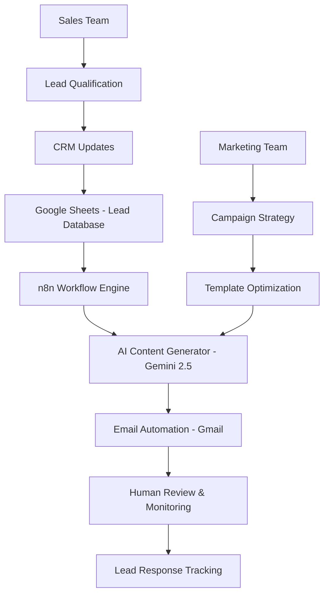

# Sales & Marketing Automation System

## 🎯 Overview

This repository contains an intelligent sales and marketing automation system built with n8n workflow automation platform. The system leverages AI-powered email generation and human oversight to streamline lead outreach for VR arcade solutions while maintaining personalization and quality control.

## 🏗️ System Architecture



## 🔄 End-to-End Flow with Human-in-the-Loop

### 1. **Data Input & Lead Management** (Human-Driven)
- **Human Role**: Sales/Marketing teams manually research and input qualified leads into Google Sheets
- **Data Points Collected**:
  - Prospect Name
  - Company Name  
  - Email Address
  - Industry Context (Family Entertainment Centers)
- **Quality Control**: Human verification ensures lead quality and relevance before automation

### 2. **Automated AI Processing** (AI-Driven)
- **Trigger**: Google Sheets monitor detects new entries every minute
- **AI Content Generation**: 
  - Uses Google's Gemini 2.5 Flash model
  - Generates personalized cold emails
  - Incorporates company-specific details
  - Maintains consistent brand voice for RGS Arcade Solutions

### 3. **Email Delivery** (Automated with Human Oversight)
- **Automated Sending**: Gmail integration delivers personalized emails
- **Human Monitoring**: Sales team tracks delivery status and responses
- **Subject Line**: Dynamic generation based on company name

### 4. **Response Management** (Human-Driven)
- **Lead Qualification**: Sales team manually reviews responses
- **Follow-up Strategy**: Human decision-making for next steps
- **CRM Updates**: Manual tracking of conversation progress

## 🤖 AI & Human Team Collaboration

### AI Strengths & Responsibilities
| AI Capability | Business Impact |
|---------------|-----------------|
| **Content Generation** | Scales personalized outreach beyond human capacity |
| **Consistency** | Maintains brand voice across all communications |
| **Speed** | Processes leads within minutes of data entry |
| **Personalization** | Incorporates prospect-specific details automatically |

### Human Strengths & Responsibilities
| Human Capability | Business Impact |
|------------------|-----------------|
| **Strategic Thinking** | Determines target market and campaign strategy |
| **Relationship Building** | Handles complex conversations and negotiations |
| **Quality Assurance** | Ensures message quality and brand compliance |
| **Lead Qualification** | Assesses prospect fit and prioritizes opportunities |

## 📋 Workflow Components

### 1. Google Sheets Trigger Node
```json
{
  "type": "n8n-nodes-base.googleSheetsTrigger",
  "purpose": "Monitors lead database for new entries",
  "polling_frequency": "Every minute",
  "data_source": "Sales Lead spreadsheet"
}
```

### 2. AI Content Generation Node
```json
{
  "type": "n8n-nodes-base.httpRequest",
  "ai_model": "Gemini 2.5 Flash",
  "purpose": "Generate personalized cold emails",
  "features": [
    "Company name personalization",
    "Industry-specific messaging",
    "Consistent brand voice",
    "Call-to-action optimization"
  ]
}
```

### 3. Email Delivery Node
```json
{
  "type": "n8n-nodes-base.gmail", 
  "purpose": "Automated email delivery",
  "personalization": "Dynamic subject lines and content",
  "sender": "Pranjal  Shukla, Sales & Partnerships"
}
```

## 🎯 Human-AI Complementarity

### Decision Points Requiring Human Judgment
1. **Lead Qualification**: Determining if a prospect fits target criteria
2. **Campaign Strategy**: Choosing messaging angles and timing
3. **Response Handling**: Managing complex objections and negotiations
4. **Quality Control**: Reviewing AI-generated content for appropriateness
5. **Relationship Building**: Personal follow-ups and relationship nurturing

### AI Optimization Areas
1. **Scale**: Processing hundreds of leads simultaneously
2. **Consistency**: Uniform brand messaging across all outreach
3. **Efficiency**: Instant email generation and delivery
4. **Personalization**: Dynamic content based on prospect data
5. **Availability**: 24/7 processing without human fatigue

## 🔧 Technical Implementation

### Prerequisites
- n8n workflow automation platform
- Google Workspace account (Sheets & Gmail)
- Google Gemini API access
- Lead database in Google Sheets format

### Setup Instructions
1. Import the workflow from `Sales_System.json`
2. Configure Google Sheets credentials
3. Set up Gmail OAuth2 authentication
4. Add Gemini API key to HTTP Request node
5. Test workflow with sample data
6. Activate automation

### Data Schema
```
Lead Database Fields:
- Name (string): Prospect's full name
- Company Name (string): Target company name
- Email (string): Contact email address
```

## 📊 Success Metrics & KPIs

### Automation Efficiency
- **Processing Speed**: Sub-minute lead-to-email conversion
- **Volume Capacity**: Unlimited concurrent processing
- **Uptime**: 24/7 availability

### Human-AI Collaboration Success
- **Response Rate**: Track email open and reply rates
- **Conversion Rate**: Measure qualified leads to demos
- **Time Savings**: Calculate hours saved vs. manual outreach
- **Quality Score**: Human assessment of AI-generated content

## 🔄 Continuous Improvement

### Human Feedback Loop
1. **Content Review**: Regular assessment of AI-generated emails
2. **Template Optimization**: Updating prompts based on performance
3. **Target Refinement**: Adjusting lead qualification criteria
4. **Process Enhancement**: Streamlining human touchpoints

### AI Model Enhancement
- Monitor email performance metrics
- A/B test different prompt variations  
- Adjust personalization parameters
- Optimize for higher response rates

## 🛡️ Compliance & Best Practices

### Email Marketing Compliance
- CAN-SPAM Act compliance
- GDPR consideration for international prospects
- Opt-out mechanisms in email templates
- Professional sender identification

### Quality Assurance
- Human review of AI outputs before deployment
- Brand voice consistency checks  
- Technical accuracy validation
- Relationship-appropriate tone assessment

## 🚀 Future Enhancements

### Planned Human-AI Improvements
1. **Response Analysis**: AI categorization of prospect replies
2. **Follow-up Automation**: Smart scheduling based on engagement
3. **Lead Scoring**: AI-assisted prospect prioritization
4. **Performance Analytics**: Automated reporting for human review
5. **Multi-channel Integration**: Expanding beyond email to LinkedIn, phone

### Scaling Considerations
- Integration with CRM systems
- Advanced lead qualification workflows
- Multi-language support for global outreach
- Sentiment analysis for response optimization

---


